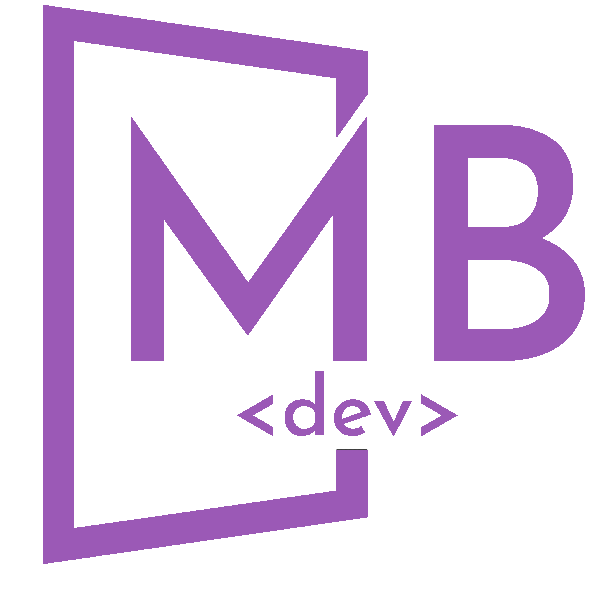

# design-patters

<!-- Section by othneildrew/Best-README-Template

*** Thanks for checking out the Best-README-Template. If you have a suggestion
*** that would make this better, please fork the repo and create a pull request
*** or simply open an issue with the tag "enhancement".
*** Don't forget to give the project a star!
*** Thanks again! Now go create something AMAZING! :D
-->

<!-- PROJECT SHIELDS -->
<!-- Section by othneildrew/Best-README-Template
*** I'm using markdown "reference style" links for readability.
*** Reference links are enclosed in brackets [ ] instead of parentheses ( ).
*** See the bottom of this document for the declaration of the reference variables
*** for contributors-url, forks-url, etc. This is an optional, concise syntax you may use.
*** https://www.markdownguide.org/basic-syntax/#reference-style-links
-->

[![Watchers][watchers-shield]][watchers-url]
[![Issues][issues-shield]][issues-url]
[![MIT License][license-shield]][license-url]
[![LinkedIn][linkedin-shield]][linkedin-url]

<!-- PROJECT LOGO -->
 

  

  <h3 align="center">Design Patterns (es)</h3>

  

    Basado en el proyecto <a href="https://refactoring.guru/es">Refactoring.guru</a>
     
    <a href="https://github.com/MateoBarrera/design-patterns-es"><strong>Explorar »</strong></a>
     
     
    <a href="https://github.com/MateoBarrera">Autor</a>
    ·
    <a href="https://github.com/MateoBarrera/design-patterns-es/issues">Reportar Bug</a>
    ·
    <a href="https://github.com/MateoBarrera/design-patterns-es/issues">Solicitar Feature</a>
  

<!-- TABLE OF CONTENTS -->

  
Tabla de contenido

  <ol>
    <li><a href="#acerca-del-proyecto">Acerca del proyecto</a></li>
    <li><a href="#introducción">Introducción</a></li>
    <li><a href="#uso-del-repositorio">Uso del repositorio</a></li>
    <li><a href="#roadmap">Roadmap</a></li>
    <li><a href="#licencia">Licencia</a></li>
    <li><a href="#contacto">Contacto</a></li>
    <li><a href="#agradecimientos">Agradecimientos</a></li>
  </ol>

<!-- ABOUT THE PROJECT -->

## Acerca del proyecto

Este repositorio contiene la aplicación de patrones de diseño clásicos impartidos de manera didáctica por medio del proyecto Refactoring.guru y presentados en el libro "Patrones de Diseño: Elementos de software orientado a objetos reutilizable" escrito por Erich Gamma, Richard Helm, Ralph Johnson y John Vlissides, la banda de los cuatro (GoF - Gang of Four).

El único objetivo de este repositorio es afianzar los conceptos impartidos por Refactoring.guru mediante ejemplos desarrollados en Python.

(<a href="#readme-top">Regresar al inicio</a>)

<!-- GETTING STARTED -->

## Introducción

Design Patterns (es) esta distribuido en carpetas de acuerdo a la siguiente clasificación de los patrones:

- Creacionales
- Estructurales
- Comportamentales

Cada patron se identifica por su nombre (en ingles) en su respectiva carpeta, e incluye una breve descripción y enlaces de complemento a los recursos correspondientes de Refactoring.Guru, los archivos .py de ejemplos acompañaran el folder respectivo.

## Prerrequisitos

Todos los ejercicios han sido desarrollados en Python 3.10.6.<!--[![Python][python-shield]][python-url].-->
Este repositorio no posee requisitos adicionales de un interprete python para su funcionamiento.

(<a href="#readme-top">Regresar al inicio</a>)

<!-- USAGE EXAMPLES -->

## Uso del repositorio

Este repositorio y su información es de libre uso, siempre que se respete el objetivo principal del mismo y las normativas aplicables a la fuente de información primaria (Refactoring.Guru).

(<a href="#readme-top">Regresar al inicio</a>)

<!-- ROADMAP -->

## Roadmap

- [x] Agg. lista de cambios
- [x] Agg. descripción del proyecto
- [x] Agg. ajustar el contenido principal
- [ ] Cargar Creacionales/FactoryMethod
- [ ] ...

Visite [open issues](https://github.com/MateoBarrera/design-patterns-es/issues) para ver una lista completa de las funciones propuestas y los problemas conocidos.

(<a href="#readme-top">Regresar al inicio</a>)

<!-- CONTRIBUTING -->
<!--
## Contribuir

 Contributions are what make the open source community such an amazing place to learn, inspire, and create. Any contributions you make are **greatly appreciated**.

If you have a suggestion that would make this better, please fork the repo and create a pull request. You can also simply open an issue with the tag "enhancement".
Don't forget to give the project a star! Thanks again!

1. Fork the Project
2. Create your Feature Branch (`git checkout -b feature/AmazingFeature`)
3. Commit your Changes (`git commit -m 'Add some AmazingFeature'`)
4. Push to the Branch (`git push origin feature/AmazingFeature`)
5. Open a Pull Request

(<a href="#readme-top">Regresar al inicio</a>)

 -->
<!-- LICENSE -->

## Licencia

Distribuido bajo la licencia MIT. Para mas información visite `LICENSE.txt` .

(<a href="#readme-top">Regresar al inicio</a>)

<!-- CONTACT -->

## Contacto

Mateo Barrera- [@materile_19](https://twitter.com/materile_19) - mateobarrerazapata@gmail.com

Enlace del proyecto: [www.github.com/MateoBarrera/design-patterns-es](https://github.com/MateoBarrera/design-patterns-es)

(<a href="#readme-top">Regresar al inicio</a>)

<!-- ACKNOWLEDGMENTS -->

## Agradecimientos

[www.refactoring.guru](https://refactoring.guru/es/design-patterns)

<!-- Use this space to list resources you find helpful and would like to give credit to. I've included a few of my favorites to kick things off!

- [Choose an Open Source License](https://choosealicense.com)
- [GitHub Emoji Cheat Sheet](https://www.webpagefx.com/tools/emoji-cheat-sheet)
- [Malven's Flexbox Cheatsheet](https://flexbox.malven.co/)
- [Malven's Grid Cheatsheet](https://grid.malven.co/)
- [Img Shields](https://shields.io)
- [GitHub Pages](https://pages.github.com)
- [Font Awesome](https://fontawesome.com)
- [React Icons](https://react-icons.github.io/react-icons/search) -->

(<a href="#readme-top">Regresar al inicio</a>)

<!-- MARKDOWN LINKS & IMAGES -->
<!-- https://www.markdownguide.org/basic-syntax/#reference-style-links -->
<!-- examples -->

[contributors-shield]: https://img.shields.io/github/contributors/othneildrew/Best-README-Template.svg?style=for-the-badge
[contributors-url]: https://github.com/MateoBarrera/design-patterns-es/graphs/contributors
[forks-shield]: https://img.shields.io/github/forks/othneildrew/Best-README-Template.svg?style=for-the-badge
[forks-url]: https://github.com/MateoBarrera/design-patterns-es/network/members
[stars-shield]: https://img.shields.io/github/stars/othneildrew/Best-README-Template.svg?style=for-the-badge
[stars-url]: https://github.com/MateoBarrera/design-patterns-es/stargazers

<!-- examples -->

<!-- main -->

[watchers-shield]: https://img.shields.io/github/watchers/MateoBarrera/design-patterns-es?style=for-the-badge
[watchers-url]: https://github.com/MateoBarrera/design-patterns-es
[issues-shield]: https://img.shields.io/bitbucket/issues-raw/MateoBarrera/design-patterns-es?style=for-the-badge
[issues-url]: https://github.com/MateoBarrera/design-patterns-es/issues
[license-shield]: https://img.shields.io/github/license/othneildrew/Best-README-Template.svg?style=for-the-badge
[license-url]: https://github.com/MateoBarrera/design-patterns-es/blob/master/LICENSE.txt
[linkedin-shield]: https://img.shields.io/badge/-LinkedIn-black.svg?style=for-the-badge&logo=linkedin&colorB=555
[linkedin-url]: https://www.linkedin.com/in/mateobarrerazapata
[python-shield]: https://img.shields.io/badge/python-3.10.6-green?style=for-the-badge&logo=python
[python-url]: https://www.python.org/

<!-- main -->
